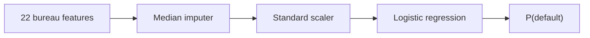

#  Predicting and Explaining Loan Default Risk with Vertex AI, BigQuery and scikit-learn 🔍

This GCP ML project focuses on **predicting and explaining loan default risk** on Vertex AI. You train a scikit-learn classifier on FICO consumer credit data, register it on Vertex, and run one batch job that returns each borrower's predicted default probability plus per-feature attributions in BigQuery.

-  GCS is used to store the sample input data
-  BigQuery holds the batch input rows and the explanation output table
-  Vertex AI uploads the model and runs batch prediction with explanations enabled
-  Looker Studio connects to the output table for dashboards

These services work together to train the model, run batch explanations, and write results to BigQuery.


Find the code and CSV file on my github account.

[github.com/04pallav/gcp-ml-tutorials/vertex-batch-explainability](https://github.com/04pallav/gcp-ml-tutorials/tree/main/vertex-batch-explainability)

#  GCS

Upload the provided CSV file to your designated Google Cloud Storage (GCS) bucket. This sample data comes from the [FICO consumer credit dataset on OpenML](https://www.openml.org/d/45023) — 10,000 borrowers a lender might score and explain. Each row includes bureau features such as `ExternalRiskEstimate`, `NumInqLast6M`, `NetFractionRevolvingBurden`, `MSinceMostRecentDelq`, and `PercentTradesNeverDelq` — outside risk score, recent credit applications, revolving utilization, months since last delinquency, and share of accounts never delinquent.


#  `batch_explain.py`

📖

`batch_explain.py` code is a batch explainability pipeline implemented using scikit-learn and Vertex AI. It reads data from an input file, trains a classifier to estimate loan default risk, registers the model on Vertex AI with explanation settings, and writes predicted probabilities plus feature attributions to a BigQuery table.

## The model

We train a **logistic regression** classifier on `heloc.csv` (10,000 labeled borrowers from the [FICO consumer credit dataset](https://www.openml.org/d/45023)).

- **Input:** 22 credit-bureau features per borrower (e.g. `ExternalRiskEstimate`, `NumInqLast6M`, `MSinceMostRecentDelq`)
- **Target:** `RiskPerformance` — **Bad (1)** = 90+ days past due at least once; **Good (0)** = paid as agreed
- **Output:** `probability` — predicted risk of default (probability of class 1)

The classifier is a scikit-learn **Pipeline** — three steps applied in order:



On a re-run, if a Vertex model named `heloc-batch-explain` already exists, steps 3–5 are skipped and the script reuses it.

The pipeline consists of the following steps:

1. Command-line arguments are parsed to specify your GCP project, GCS bucket, and input file.
2. The data is read from the input file and loaded into the BigQuery table `heloc_batch_input` — one FLOAT column per feature.
3. The training data is read from `heloc.csv` and a scikit-learn pipeline is trained (median imputer → standard scaler → logistic regression).
4. `model.joblib` and `feature_names.json` are uploaded to your GCS bucket.
5. The model is registered on Vertex AI with explanation settings for all 22 input features.
6. A batch prediction job reads from `heloc_batch_input`, scores each row, and writes predictions plus feature attributions to `heloc_batch_explanations`.
7. The batch job is started, and the model and job resource names are printed to the console.

When you run the script, numbered progress lines appear in the shell:

```
[1] project=your-project-id bucket=gs://your-bucket/vertex-batch-explain instances=gs://your-bucket/instances.csv
[2] Reading instances from gs://your-bucket/instances.csv
[2] Loading 10000 rows to BigQuery table heloc_batch_input
[2] Done — your-project-id.ml_explainability.heloc_batch_input
[3] Training scikit-learn pipeline on heloc.csv
[3] Done — model trained
[4] Uploading model artifacts to gs://your-bucket/vertex-batch-explain/models/
[4] Uploaded gs://your-bucket/vertex-batch-explain/models/model.joblib
[4] Uploaded gs://your-bucket/vertex-batch-explain/models/feature_names.json
[5] Registering model on Vertex AI with explanation settings
[5] Done — projects/.../locations/us-central1/models/...
[6] Starting batch prediction: heloc_batch_input → heloc_batch_explanations
[7] Batch job started: projects/.../locations/us-central1/batchPredictionJobs/...
[7] Model: projects/.../locations/us-central1/models/...
```

👩‍💻

Set the project in the cloud shell: `gcloud config set project your-project-id`

Install scikit-learn and the Vertex AI SDK in the cloud shell: `pip install google-cloud-aiplatform 'scikit-learn==1.6.*'`

Give the batch_explain.py code a test run in the shell and then check the results in BigQuery: `python batch_explain.py --project-id your-project-id --bucket-uri gs://your-bucket/vertex-batch-explain --instances gs://your-bucket/instances.csv`

❗ Make sure that all your files and services are in the same location. E.g. both buckets should be in the same location or you will get a similar error message: ‘Cannot read and write in different locations: source: US, destination: EU’

# 📊 BigQuery

Open BigQuery and check the input table:

```sql
SELECT * FROM `your-project-id.ml_explainability.heloc_batch_input` LIMIT 10;
```

You should see 10,000 rows from `instances.csv`.

After the batch job finishes, open the output table:

```sql
SELECT * FROM `your-project-id.ml_explainability.heloc_batch_explanations` LIMIT 10;
```

Each row has a prediction and **feature attributions** — how much each input feature pushed the score up or down for that borrower.

# 🤖 Vertex AI

Open **Vertex AI → Batch predictions** in the console. Wait for **JOB_STATE_SUCCEEDED**.

# 📈 Looker Studio

Connect Looker Studio to `heloc_batch_explanations` and build a bar chart of top attributions per borrower.

## About

GCP ML explainability on consumer credit data — BigQuery in, default probabilities + feature attributions out.
